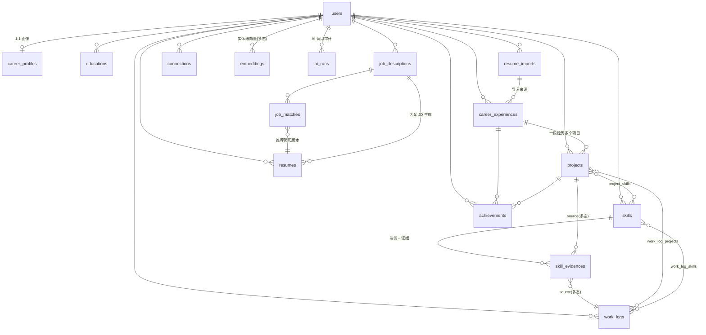

# CareerOS 数据库设计（PostgreSQL 16 + pgvector）

Schema 名：`careeros`（与 WeKnora 共享实例、隔离 schema）。
主键统一 `uuid`（`gen_random_uuid()`），时间统一 `timestamptz`，软删除仅用于核心实体（`deleted_at`）。

## 1. ER 图



多态关联（`source_type` + `source_id`）不建外键，由应用层保证 + 定期一致性任务清理孤儿行（同 WeKnora `embeddings` 的做法）。

## 2. DDL

```sql
CREATE SCHEMA IF NOT EXISTS careeros;
SET search_path TO careeros;
CREATE EXTENSION IF NOT EXISTS vector;
CREATE EXTENSION IF NOT EXISTS pg_trgm;
CREATE EXTENSION IF NOT EXISTS citext;

-- ============ 枚举 ============
CREATE TYPE user_role       AS ENUM ('guest','user','recruiter','admin','enterprise');
CREATE TYPE job_status      AS ENUM ('open','passive','closed');         -- 求职状态
CREATE TYPE entity_source   AS ENUM ('manual','import','ai');            -- 数据来源
CREATE TYPE import_status   AS ENUM ('pending','parsing','extracting','review','applied','failed');
CREATE TYPE jd_status       AS ENUM ('pending','parsing','parsed','failed');
CREATE TYPE resume_type     AS ENUM ('zh','en','ja_shokumu','linkedin','cover_letter');
CREATE TYPE resume_status   AS ENUM ('draft','final','archived');
CREATE TYPE evidence_source AS ENUM ('project','experience','work_log','achievement','certificate','external');
CREATE TYPE worklog_source  AS ENUM ('manual','voice','email','notion','github');
CREATE TYPE connection_type AS ENUM ('follow','friend','colleague');
CREATE TYPE connection_status AS ENUM ('pending','accepted','blocked');
CREATE TYPE ai_run_kind     AS ENUM ('resume_parse','jd_parse','resume_generate','profile_generate',
                                     'worklog_summarize','job_match','skill_extract','translate');
CREATE TYPE ai_run_status   AS ENUM ('queued','running','succeeded','failed');

-- ============ 用户与画像 ============
CREATE TABLE users (
  id            uuid PRIMARY KEY DEFAULT gen_random_uuid(),
  email         citext UNIQUE NOT NULL,
  name          varchar(128) NOT NULL,
  avatar_url    text,
  role          user_role NOT NULL DEFAULT 'user',
  locale        varchar(8) NOT NULL DEFAULT 'zh',      -- UI 语言 zh/en/ja
  region        varchar(64),                            -- 所在地区
  languages     text[] NOT NULL DEFAULT '{}',           -- 工作语言 ['zh','ja','en']
  job_status    job_status NOT NULL DEFAULT 'passive',
  privacy       jsonb NOT NULL DEFAULT '{
    "profile_public": false,
    "resume_searchable": false,
    "recruiter_contact": false,
    "feed_visible": false
  }',
  weknora_kb_id  varchar(64),                           -- 该用户的 WeKnora 职业档案库 ID
  weknora_api_key text,                                 -- 加密存储（应用层 AES-GCM）
  created_at    timestamptz NOT NULL DEFAULT now(),
  updated_at    timestamptz NOT NULL DEFAULT now(),
  deleted_at    timestamptz
);
-- Auth.js 需要的 accounts / sessions / verification_tokens 由 @auth/prisma-adapter 生成，不在此赘述

CREATE TABLE career_profiles (
  id               uuid PRIMARY KEY DEFAULT gen_random_uuid(),
  user_id          uuid NOT NULL UNIQUE REFERENCES users(id) ON DELETE CASCADE,
  headline         varchar(128),               -- "海外游戏发行专家"
  summary          text,                        -- AI 生成的职业综述
  career_tags      text[] NOT NULL DEFAULT '{}',
  career_level     varchar(32),                 -- junior/mid/senior/staff/exec
  years_experience numeric(4,1),
  industry_tags    text[] NOT NULL DEFAULT '{}',
  is_stale         boolean NOT NULL DEFAULT true, -- 实体变更后置 true，触发重生成提示
  generated_run_id uuid,                        -- 最近一次生成的 ai_runs.id
  updated_at       timestamptz NOT NULL DEFAULT now()
);

-- ============ 职业实体 ============
CREATE TABLE career_experiences (
  id            uuid PRIMARY KEY DEFAULT gen_random_uuid(),
  user_id       uuid NOT NULL REFERENCES users(id) ON DELETE CASCADE,
  company       varchar(128) NOT NULL,
  company_norm  varchar(128) NOT NULL,          -- 归一化名（小写去后缀），用于去重/图谱聚合
  title         varchar(128) NOT NULL,
  employment_type varchar(32),                  -- fulltime/contract/intern/freelance
  start_date    date NOT NULL,
  end_date      date,                           -- NULL = 至今
  location      varchar(128),
  description   text,                           -- 职责综述（Markdown）
  highlights    text[] NOT NULL DEFAULT '{}',   -- 条目式职责/亮点，简历 bullet 的直接来源
  lang          varchar(8) NOT NULL DEFAULT 'zh',
  source        entity_source NOT NULL DEFAULT 'manual',
  import_id     uuid REFERENCES resume_imports(id) ON DELETE SET NULL,
  sort_order    int NOT NULL DEFAULT 0,
  created_at    timestamptz NOT NULL DEFAULT now(),
  updated_at    timestamptz NOT NULL DEFAULT now(),
  deleted_at    timestamptz,
  CONSTRAINT chk_exp_dates CHECK (end_date IS NULL OR end_date >= start_date)
);
CREATE INDEX idx_exp_user ON career_experiences(user_id, start_date DESC) WHERE deleted_at IS NULL;
CREATE INDEX idx_exp_company_trgm ON career_experiences USING gin (company_norm gin_trgm_ops);

CREATE TABLE projects (
  id            uuid PRIMARY KEY DEFAULT gen_random_uuid(),
  user_id       uuid NOT NULL REFERENCES users(id) ON DELETE CASCADE,
  experience_id uuid REFERENCES career_experiences(id) ON DELETE SET NULL, -- 可为个人项目
  name          varchar(160) NOT NULL,
  role          varchar(128),
  start_date    date,
  end_date      date,
  description   text,
  outcome       text,                           -- 项目成果综述
  links         jsonb NOT NULL DEFAULT '[]',    -- [{label, url}] 作品集/仓库链接
  tech_stack    text[] NOT NULL DEFAULT '{}',
  lang          varchar(8) NOT NULL DEFAULT 'zh',
  source        entity_source NOT NULL DEFAULT 'manual',
  import_id     uuid REFERENCES resume_imports(id) ON DELETE SET NULL,
  sort_order    int NOT NULL DEFAULT 0,
  created_at    timestamptz NOT NULL DEFAULT now(),
  updated_at    timestamptz NOT NULL DEFAULT now(),
  deleted_at    timestamptz
);
CREATE INDEX idx_proj_user ON projects(user_id, start_date DESC NULLS LAST) WHERE deleted_at IS NULL;
CREATE INDEX idx_proj_exp  ON projects(experience_id);

CREATE TABLE skills (
  id           uuid PRIMARY KEY DEFAULT gen_random_uuid(),
  user_id      uuid NOT NULL REFERENCES users(id) ON DELETE CASCADE,
  name         varchar(80) NOT NULL,
  name_norm    varchar(80) NOT NULL,             -- lower + 别名归一（"PostgreSQL"/"postgres"→"postgresql"）
  category     varchar(48),                      -- language/framework/tool/domain/soft
  level        smallint NOT NULL DEFAULT 0 CHECK (level BETWEEN 0 AND 100),
  level_source entity_source NOT NULL DEFAULT 'manual', -- ai=由证据推算，manual=用户覆写
  first_used_at date,
  last_used_at  date,                            -- 由证据自动滚动更新，驱动"技能成长曲线"
  created_at   timestamptz NOT NULL DEFAULT now(),
  updated_at   timestamptz NOT NULL DEFAULT now(),
  UNIQUE (user_id, name_norm)
);
CREATE INDEX idx_skill_name_trgm ON skills USING gin (name_norm gin_trgm_ops);

-- 技能 → 证据（多态）：技能必须有出处，这是"技能不能只保存名称"的落地
CREATE TABLE skill_evidences (
  id           uuid PRIMARY KEY DEFAULT gen_random_uuid(),
  skill_id     uuid NOT NULL REFERENCES skills(id) ON DELETE CASCADE,
  source_type  evidence_source NOT NULL,
  source_id    uuid,                             -- external 类型可为 NULL
  note         text,                             -- "在项目A负责全部SQL调优"
  url          text,                             -- external 证据链接（证书等）
  weight       smallint NOT NULL DEFAULT 1 CHECK (weight BETWEEN 1 AND 5),
  created_at   timestamptz NOT NULL DEFAULT now(),
  UNIQUE (skill_id, source_type, source_id)
);
CREATE INDEX idx_evidence_source ON skill_evidences(source_type, source_id);

CREATE TABLE achievements (
  id            uuid PRIMARY KEY DEFAULT gen_random_uuid(),
  user_id       uuid NOT NULL REFERENCES users(id) ON DELETE CASCADE,
  experience_id uuid REFERENCES career_experiences(id) ON DELETE SET NULL,
  project_id    uuid REFERENCES projects(id) ON DELETE SET NULL,
  title         varchar(200) NOT NULL,           -- "日本区收入增长30%"
  metric_value  numeric,                          -- 30
  metric_unit   varchar(32),                      -- '%','人','份','万元'
  metric_text   varchar(120),                     -- 无法量化时的原文 "管理20人团队"
  evidence      text,                             -- 佐证说明/链接
  occurred_at   date,
  created_at    timestamptz NOT NULL DEFAULT now(),
  updated_at    timestamptz NOT NULL DEFAULT now()
);
CREATE INDEX idx_ach_user ON achievements(user_id);
CREATE INDEX idx_ach_exp  ON achievements(experience_id);
CREATE INDEX idx_ach_proj ON achievements(project_id);

CREATE TABLE educations (
  id         uuid PRIMARY KEY DEFAULT gen_random_uuid(),
  user_id    uuid NOT NULL REFERENCES users(id) ON DELETE CASCADE,
  school     varchar(160) NOT NULL,
  degree     varchar(64),
  major      varchar(128),
  start_date date,
  end_date   date,
  gpa        varchar(16),
  description text,
  sort_order int NOT NULL DEFAULT 0,
  created_at timestamptz NOT NULL DEFAULT now(),
  updated_at timestamptz NOT NULL DEFAULT now()
);
CREATE INDEX idx_edu_user ON educations(user_id);

-- ============ 工作日志（系统核心） ============
CREATE TABLE work_logs (
  id          uuid PRIMARY KEY DEFAULT gen_random_uuid(),
  user_id     uuid NOT NULL REFERENCES users(id) ON DELETE CASCADE,
  log_date    date NOT NULL,
  title       varchar(200) NOT NULL,
  content     text NOT NULL,                     -- Markdown
  tags        text[] NOT NULL DEFAULT '{}',
  ai_summary  text,                              -- AI 摘要（1-2 句）
  source      worklog_source NOT NULL DEFAULT 'manual',
  external_ref jsonb,                            -- github commit sha / notion page id …（Phase 2）
  weknora_knowledge_id varchar(64),              -- 同步进 WeKnora KB 的对应 ID，供证据检索
  created_at  timestamptz NOT NULL DEFAULT now(),
  updated_at  timestamptz NOT NULL DEFAULT now(),
  deleted_at  timestamptz
);
CREATE INDEX idx_wl_user_date ON work_logs(user_id, log_date DESC) WHERE deleted_at IS NULL;
CREATE INDEX idx_wl_tags ON work_logs USING gin (tags);

CREATE TABLE work_log_projects (
  work_log_id uuid NOT NULL REFERENCES work_logs(id) ON DELETE CASCADE,
  project_id  uuid NOT NULL REFERENCES projects(id) ON DELETE CASCADE,
  PRIMARY KEY (work_log_id, project_id)
);
CREATE TABLE work_log_skills (
  work_log_id uuid NOT NULL REFERENCES work_logs(id) ON DELETE CASCADE,
  skill_id    uuid NOT NULL REFERENCES skills(id) ON DELETE CASCADE,
  PRIMARY KEY (work_log_id, skill_id)
);
CREATE TABLE project_skills (
  project_id uuid NOT NULL REFERENCES projects(id) ON DELETE CASCADE,
  skill_id   uuid NOT NULL REFERENCES skills(id) ON DELETE CASCADE,
  PRIMARY KEY (project_id, skill_id)
);

-- ============ 导入 ============
CREATE TABLE resume_imports (
  id           uuid PRIMARY KEY DEFAULT gen_random_uuid(),
  user_id      uuid NOT NULL REFERENCES users(id) ON DELETE CASCADE,
  file_key     text NOT NULL,                    -- S3/MinIO key
  file_name    varchar(255) NOT NULL,
  mime_type    varchar(128) NOT NULL,
  status       import_status NOT NULL DEFAULT 'pending',
  raw_text     text,                             -- docreader 输出的 Markdown
  extracted    jsonb,                            -- LLM 结构化结果（候选实体，待人工确认）
  applied_diff jsonb,                            -- 确认页最终写入了什么（审计）
  error        text,
  weknora_knowledge_id varchar(64),              -- 原文同时入 WeKnora KB
  created_at   timestamptz NOT NULL DEFAULT now(),
  updated_at   timestamptz NOT NULL DEFAULT now()
);
CREATE INDEX idx_import_user ON resume_imports(user_id, created_at DESC);

-- ============ JD 与匹配 ============
CREATE TABLE job_descriptions (
  id          uuid PRIMARY KEY DEFAULT gen_random_uuid(),
  user_id     uuid NOT NULL REFERENCES users(id) ON DELETE CASCADE, -- MVP：JD 归用户私有；企业端阶段再加 org_id
  company     varchar(128),
  title       varchar(160),
  source_url  text,
  file_key    text,
  raw_content text NOT NULL,
  lang        varchar(8),
  status      jd_status NOT NULL DEFAULT 'pending',
  parsed      jsonb,
  -- parsed 结构：{ "skills":[{"name","required":bool,"weight":1-5}],
  --              "experience":[{"desc","years_min"}], "industry":[], "keywords":[],
  --              "languages":[], "location","salary_range","seniority" }
  created_at  timestamptz NOT NULL DEFAULT now(),
  updated_at  timestamptz NOT NULL DEFAULT now()
);
CREATE INDEX idx_jd_user ON job_descriptions(user_id, created_at DESC);

CREATE TABLE job_matches (
  id                  uuid PRIMARY KEY DEFAULT gen_random_uuid(),
  jd_id               uuid NOT NULL REFERENCES job_descriptions(id) ON DELETE CASCADE,
  user_id             uuid NOT NULL REFERENCES users(id) ON DELETE CASCADE,
  match_score         numeric(5,2) NOT NULL,     -- 0-100，加权总分
  skill_coverage      numeric(5,2) NOT NULL,
  experience_coverage numeric(5,2) NOT NULL,
  industry_coverage   numeric(5,2) NOT NULL,
  missing_skills      jsonb NOT NULL DEFAULT '[]',  -- [{"name","required","suggestion"}]
  matched_evidence    jsonb NOT NULL DEFAULT '[]',  -- [{jd_item, entity_type, entity_id, similarity}]
  resume_id           uuid REFERENCES resumes(id) ON DELETE SET NULL, -- 基于本次匹配生成的简历
  run_id              uuid,                          -- ai_runs.id
  created_at          timestamptz NOT NULL DEFAULT now()
);
CREATE INDEX idx_match_jd ON job_matches(jd_id, created_at DESC);

-- ============ 简历（快照/视图） ============
CREATE TABLE resumes (
  id           uuid PRIMARY KEY DEFAULT gen_random_uuid(),
  user_id      uuid NOT NULL REFERENCES users(id) ON DELETE CASCADE,
  title        varchar(160) NOT NULL,            -- "任天堂 海外发行PM · 日文版"
  resume_type  resume_type NOT NULL,
  version      int NOT NULL DEFAULT 1,           -- 同 title 下自增
  template_id  varchar(64) NOT NULL DEFAULT 'openresume-classic',
  resume_json  jsonb NOT NULL,                   -- JSON Resume Schema（日文扩展在 x-jis 键下）
  jd_id        uuid REFERENCES job_descriptions(id) ON DELETE SET NULL,
  status       resume_status NOT NULL DEFAULT 'draft',
  pdf_file_key text,                             -- 最近一次导出的 PDF
  generated_at timestamptz NOT NULL DEFAULT now(),
  updated_at   timestamptz NOT NULL DEFAULT now(),
  deleted_at   timestamptz
);
CREATE INDEX idx_resume_user ON resumes(user_id, updated_at DESC) WHERE deleted_at IS NULL;

-- ============ 社交（Phase 7 预留，MVP 不实现） ============
CREATE TABLE connections (
  id             uuid PRIMARY KEY DEFAULT gen_random_uuid(),
  user_id        uuid NOT NULL REFERENCES users(id) ON DELETE CASCADE,
  target_user_id uuid NOT NULL REFERENCES users(id) ON DELETE CASCADE,
  type           connection_type NOT NULL,
  status         connection_status NOT NULL DEFAULT 'pending',
  created_at     timestamptz NOT NULL DEFAULT now(),
  UNIQUE (user_id, target_user_id, type),
  CHECK (user_id <> target_user_id)
);

-- ============ 向量（实体级，多态） ============
CREATE TABLE embeddings (
  id           uuid PRIMARY KEY DEFAULT gen_random_uuid(),
  user_id      uuid NOT NULL REFERENCES users(id) ON DELETE CASCADE,
  source_type  varchar(32) NOT NULL,   -- experience|project|skill|achievement|work_log|jd|jd_skill
  source_id    uuid NOT NULL,
  content_hash varchar(64) NOT NULL,   -- sha256(嵌入文本)，内容没变就跳过重嵌
  model_id     varchar(64) NOT NULL,
  dimension    int NOT NULL,
  embedding    halfvec NOT NULL,
  created_at   timestamptz NOT NULL DEFAULT now(),
  UNIQUE (source_type, source_id, model_id)
);
-- 按维度建 HNSW 分区索引（WeKnora 同款模式），常用维度示例：
CREATE INDEX idx_emb_1536 ON embeddings
  USING hnsw ((embedding::halfvec(1536)) halfvec_cosine_ops)
  WITH (m = 16, ef_construction = 64) WHERE (dimension = 1536);
CREATE INDEX idx_emb_user_type ON embeddings(user_id, source_type);

-- ============ AI 审计 ============
CREATE TABLE ai_runs (
  id            uuid PRIMARY KEY DEFAULT gen_random_uuid(),
  user_id       uuid REFERENCES users(id) ON DELETE SET NULL,
  kind          ai_run_kind NOT NULL,
  status        ai_run_status NOT NULL DEFAULT 'queued',
  input_ref     jsonb,                  -- {import_id} / {jd_id} / {resume_id} …
  model         varchar(64),
  prompt_version varchar(32),           -- 提示词版本号，回归排查用
  tokens_in     int, tokens_out int,
  cost_usd      numeric(10,6),
  latency_ms    int,
  error         text,
  created_at    timestamptz NOT NULL DEFAULT now(),
  finished_at   timestamptz
);
CREATE INDEX idx_airun_user ON ai_runs(user_id, created_at DESC);
CREATE INDEX idx_airun_kind ON ai_runs(kind, status);
```

## 3. 关键设计说明

### 3.1 技能证据链（计划书第 3 节要求的核心）
`skills.level` 默认由证据推算（`level_source='ai'`）：
```
level = clamp( Σ(evidence.weight × source_type_factor × recency_decay) 归一化, 0, 100 )
  source_type_factor: project=3, achievement=3, experience=2, work_log=1, certificate=4
  recency_decay: 最近 1 年 1.0，每多一年 ×0.85
```
用户手动覆写后 `level_source='manual'`，推算不再覆盖（只在证据面板显示"建议值"）。`last_used_at` 随最新证据日期滚动 → Skill Center 成长曲线直接查 `skill_evidences` 按时间聚合。

### 3.2 JD 匹配打分
```
match_score = 0.5×skill_coverage + 0.3×experience_coverage + 0.2×industry_coverage

skill_coverage：JD 每个技能按 weight 加权。命中判定 = name_norm 精确/别名匹配，
  或 embeddings 余弦相似度 ≥ 0.85；命中得分 × min(user_skill.level/70, 1)。
experience_coverage：JD experience 条目 embedding 对 experiences+projects 向量
  取 top-1 相似度，≥0.80 记满分、0.65-0.80 线性折算、<0.65 记 0，再平均。
industry_coverage：JD industry tags 对 career_profiles.industry_tags 的命中率。
```
公式常量放配置表而非硬编码，便于调参。`matched_evidence` 保留每条命中的实体 ID 与相似度，前端可解释("这条要求命中了项目X")。

### 3.3 与 WeKnora 的数据分工
| 数据 | 归属 |
|---|---|
| 结构化职业实体 + 实体级向量 | CareerOS（本 schema） |
| 简历/JD 原始文件 | MinIO（CareerOS 桶） |
| 原文全文 chunk + 块级向量 + 混合检索 | WeKnora KB（每用户一库，`users.weknora_kb_id`） |
| 文件→文本解析 | WeKnora docreader（无状态调用） |

### 3.4 图谱视图（无图数据库）
Career Graph 页的图数据由一条聚合查询产出：节点 = user/experiences/projects/skills/achievements，边 = 外键与关联表（WORKED_AT=experiences、PARTICIPATED_IN=projects.experience_id、HAS_SKILL=project_skills/skill_evidences、HAS_ACHIEVEMENT=achievements 外键）。接口见 02 文档 `GET /career/graph`。
