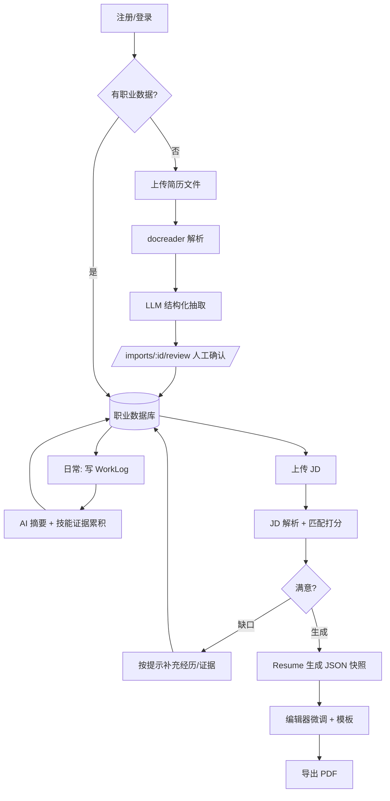

# CareerOS 页面 PRD（Next.js + shadcn/ui）

## 0. 信息架构与路由

```
/                     Landing（未登录）
/dashboard            Dashboard
/knowledge            Career Knowledge Base（Tab: 经历/项目/成果/教育）
/knowledge/graph      图谱视图
/worklogs             Work Log
/skills               Skill Center
/resumes              Resume Center（列表）
/resumes/[id]         简历编辑/预览
/imports/[id]/review  导入确认页（管线关键页）
/jobs                 Job Matching（JD 库 + 匹配）
/jobs/[id]            JD 详情 + 匹配报告
/settings             Settings
```

全局布局：左侧 `Sidebar`（导航 + 用户卡片），顶部 `Topbar`（全局搜索 ⌘K、语言切换、任务通知铃铛——异步任务完成后此处提示）。

通用组件约定（shadcn/ui）：列表页 = `DataTable` + `EmptyState`；表单 = `Sheet`（侧滑）或 `Dialog` + `react-hook-form` + zod（与 API Schema 同源）；异步任务 = `TaskProgress`（订阅 `GET /tasks/:id/events` SSE）。

---

## 1. Dashboard `/dashboard`

**目标**：一屏回答"我的职业资产现在什么状态"，并把用户引导向两个核心动作：写日志、补数据。

**数据来源**：`GET /me`、`GET /career/profile`、`GET /career/timeline`、`GET /worklogs?page_size=5`、`GET /matches?recent=3`。

**组件树**：
```
DashboardPage
├─ ProfileHeroCard          # 头像/headline/career_tags/求职状态 Badge
│   └─ StaleBanner          # profile.is_stale 时提示"资料有更新，重新生成画像" → POST regenerate
├─ StatsRow (4× StatCard)   # 经历数 / 项目数 / 技能数 / 日志连续天数
├─ Grid 2col
│   ├─ RecentWorkLogs       # 最近5条 + 「写今天的日志」CTA
│   ├─ SkillGrowthCard      # top5 技能 mini 曲线（近90天证据数）
│   ├─ CareerTimelinePreview# 横向时间轴（经历+项目）
│   └─ RecentMatchesCard    # 最近3次 JD 匹配分数，空态引导上传 JD
└─ OnboardingChecklist      # 首次使用：导入简历→确认数据→写第一篇日志→试一次匹配
```

**交互**：StatCard 点击跳对应模块；OnboardingChecklist 完成 4 项后永久隐藏（`users.privacy` 旁挂 `onboarding` JSONB，或 localStorage）。

**空态**：无任何数据时整页替换为 `ImportFirstScreen`（上传简历大按钮 + "手动开始"次按钮）。

---

## 2. 导入确认页 `/imports/[id]/review` ★ 管线成败关键页

**目标**：让用户在 3 分钟内核对 LLM 抽取结果并入库。这是 ADR-005"解析结果必须人工确认"的落地。

**数据来源**：`GET /imports/:id/extracted`；提交 `POST /imports/:id/apply`。

**组件树**：
```
ImportReviewPage
├─ SplitView
│   ├─ left: RawTextPane          # docreader 的 Markdown 原文，抽取项高亮锚点
│   └─ right: ExtractedEntityList
│       ├─ EntitySection(经历) ×n  # 每条 = Card：字段可编辑(inline input)
│       │   ├─ ConfidenceBadge     # LLM 置信度 高/中/低（低=橙色，强提醒核对）
│       │   ├─ DuplicateHint       # 与库中现有实体相似度>0.9 → "疑似重复：合并/新建"
│       │   └─ IncludeSwitch       # 勾选是否入库（默认高置信=开）
│       ├─ EntitySection(项目/技能/成果/教育) 同构
│       └─ SkillChipEditor         # 技能以 chips 呈现，可增删、改分类
└─ StickyFooter: [全部入库 n 项] [放弃本次导入]
```

**交互**：点击右侧实体 → 左侧原文滚动到对应高亮；apply 成功 → toast + 跳 `/knowledge`；`status=extracting` 时显示 `TaskProgress` 流水线动画（解析→抽取→就绪）。

---

## 3. Career Knowledge Base `/knowledge`

**目标**：职业实体的完整 CRUD 主界面，"职业数据库"的直接呈现。

**数据来源**：`GET /experiences | /projects | /achievements | /educations`。

**组件树**：
```
KnowledgePage
├─ Tabs [经历 | 项目 | 成果 | 教育 | 图谱↗]
├─ ExperienceTab
│   ├─ ExperienceTimeline        # 垂直时间轴，公司 logo 占位 + 时间段
│   │   └─ ExperienceCard        # 展开显示 highlights / 关联项目 chips / 成果
│   └─ AddExperienceSheet        # 侧滑表单
├─ ProjectTab: ProjectGrid + 过滤(按经历/技能) + AddProjectSheet
│   └─ ProjectCard: 角色/周期/tech_stack chips/成果/关联日志数
├─ AchievementTab: DataTable(标题/指标/挂靠对象/时间) 行内编辑
└─ EducationTab: 简单列表
```

**交互**：ExperienceCard 内可直接"＋添加项目"（预填 experience_id）；删除实体时若存在技能证据引用 → AlertDialog 说明将同时移除 n 条证据。

---

## 4. 图谱视图 `/knowledge/graph`

**目标**：职业数据的关系可视化（计划书 Career Graph）。

**数据来源**：`GET /career/graph`。

**实现**：react-flow（受控布局：user 居中，经历环绕，项目/技能二层，dagre 自动布局）。节点点击 → 右侧 `NodeInspector` 抽屉显示实体详情 + "去编辑"。边 hover 显示关系类型。提供 `按类型过滤` LegendBar。MVP 只读，不做图上编辑。

---

## 5. Work Log `/worklogs`

**目标**：最低摩擦的持续记录入口（系统核心资产的日常来源）。

**数据来源**：`GET/POST /worklogs`、`POST /worklogs/:id/summarize`。

**组件树**：
```
WorkLogPage
├─ WeekStrip                 # 本周7天打卡点，缺口即视觉提醒
├─ QuickComposer             # 顶部常驻：标题+Markdown编辑器(极简)+tag输入+项目选择
│   └─ 保存后自动触发 summarize（异步，完成后卡片上出现 AI 摘要）
├─ FilterBar                 # 日期范围 / tag / 项目 / 关键词
└─ LogList (虚拟滚动)
    └─ LogCard: 日期/标题/AI摘要/tags/关联项目/技能 chips
        └─ SuggestionRow     # AI 建议关联的技能/项目 → 一键接受(写 work_log_skills)
```

**交互**：编辑器 `⌘Enter` 保存；AI 摘要完成后 `SuggestionRow` 出现"检测到技能：SQL、市场分析 [+采纳]"——采纳即为技能自动累积证据（skill_evidences.source_type='work_log'）。这是"日志→技能证据"飞轮的 UI 落点。

---

## 6. Skill Center `/skills`

**目标**：呈现"技能 → 证据 → 熟练度"链条，替代自评式技能列表。

**数据来源**：`GET /skills`、`GET /skills/:id/evidences`。

**组件树**：
```
SkillCenterPage
├─ CategoryFilter (language/framework/tool/domain/soft)
├─ SkillGrid
│   └─ SkillCard: 名称/level 环形进度/evidenceCount/last_used_at
└─ SkillDetailSheet (点击展开)
    ├─ LevelSection: AI建议值 vs 手动值，Slider 覆写（覆写后标记 manual）
    ├─ EvidenceList: 按时间倒序，来源图标(项目/日志/成果/证书)，可删可加
    ├─ GrowthChart: 证据数按月聚合的成长曲线（recharts AreaChart）
    └─ AddEvidenceForm: 选择来源实体或外部链接(证书)
```

**空态**：无技能时引导"从导入简历或写日志开始，技能会自动出现"。

---

## 7. Job Matching `/jobs`

**目标**：JD 进 → 匹配报告出 → 一键生成定向简历。MVP 的价值闭环页。

**数据来源**：`POST /jds/import`、`GET /jds`、`POST /jds/:id/match`、`GET /matches/:id`、`POST /resumes/generate`。

**组件树**：
```
JobsPage
├─ JDImportZone              # 拖拽文件 / 粘贴链接 / 粘贴文本 三态输入
└─ JDTable: 公司/职位/解析状态/最近匹配分/操作

JDDetailPage (/jobs/[id])
├─ JDPane                    # 左：原文 + parsed 结构化标签（技能按 required/加权染色）
└─ MatchReport               # 右：
    ├─ ScoreGauge            # match_score 大表盘 + 三项子分条形
    ├─ MatchedEvidenceList   # "要求→命中实体"逐条对照，点击跳实体
    ├─ MissingSkillsCard     # 缺失技能 + AI 建议（"你有 X 相近经验，可补充证据"）
    └─ CTA: [基于此 JD 生成简历] → GenerateResumeDialog(选类型/模板/语言)
                                  → 成功后跳 /resumes/[id]
```

**交互**：解析中/匹配中都用 `TaskProgress`；重新匹配保留历史 match 记录（下拉切换查看，验证数据补充后分数变化——留存钩子）。

---

## 8. Resume Center `/resumes` 与编辑页 `/resumes/[id]`

**目标**：管理所有简历快照；编辑页做"微调快照 + 实时预览 + 导出"。

**数据来源**：`GET /resumes`、`PUT /resumes/:id`、`POST /resumes/:id/export`、`GET /resumes/:id/file`。

**组件树**：
```
ResumeListPage
├─ GenerateButton → GenerateResumeDialog（可不选 JD = 通用简历）
├─ UploadButton   → 走 /imports/resume 管线（入口复用）
└─ ResumeGrid: ResumeCard(缩略图/类型Badge zh·en·職務経歴書/版本/来源JD/状态)

ResumeEditorPage
├─ SplitView
│   ├─ left: SectionEditor        # 按 JSON Resume 段落分组的表单(basics/work/skills…)
│   │   └─ RegenerateSectionBtn   # 单段落 AI 重写（保持事实，换措辞/长度）
│   └─ right: LivePreview         # OpenResume 渲染组件实时渲染 resume_json
├─ Toolbar: 模板切换 Select / 语言 Badge / [导出 PDF] / 版本历史 Popover
└─ FactWarningBar                 # 编辑内容若与职业库实体冲突 → 提示"简历是视图，
                                  # 修改事实请前往知识库"（ADR-005 的 UI 表达）
```

---

## 9. Settings `/settings`

Tabs：账户（姓名/头像/语言/地区/求职状态）· 隐私（privacy JSONB 的 4 个 Switch：主页公开/简历可被搜索/接受招聘者联系/动态可见——后两者 MVP 置灰标"即将上线"）· AI 偏好（默认生成语言、语气 formal/neutral）· 数据（导出全部数据 JSON / 删除账户 AlertDialog 双确认）。

---

## 10. 核心用户流程图


