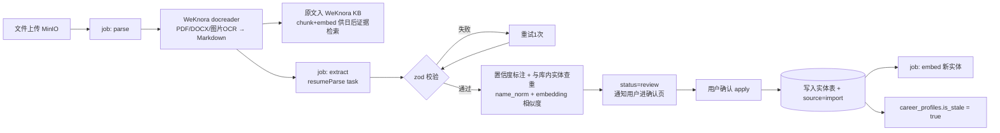
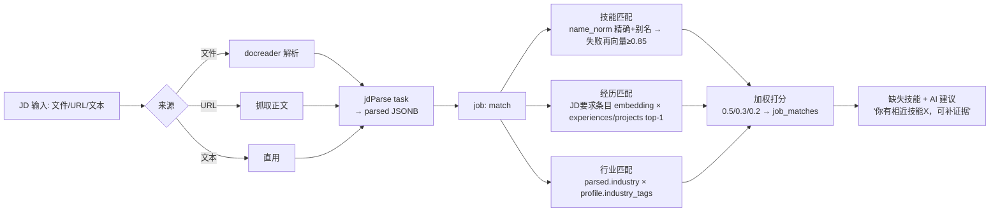
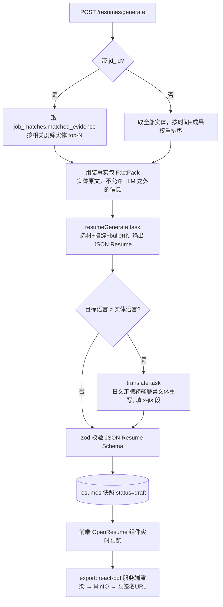

# CareerOS AI 工作流设计

## 0. AI Gateway 模块

单一入口 `src/lib/ai/`，所有 LLM 调用必须经过它，不允许业务代码直连 SDK。

```
ai/
├─ gateway.ts        # run(task, input) → 路由到 provider + 模型；重试/超时/降级
├─ providers/        # openai.ts / gemini.ts / deepseek.ts（统一 ChatCompletion 接口）
├─ tasks/            # 每个能力一个文件：schema(zod) + prompt + 后处理
│   ├─ resumeParse.ts
│   ├─ jdParse.ts
│   ├─ resumeGenerate.ts
│   ├─ profileGenerate.ts
│   ├─ worklogSummarize.ts
│   └─ translate.ts
├─ embedding.ts      # embed(texts[]) → 写 embeddings 表（content_hash 去重）
└─ audit.ts          # 每次调用落 ai_runs（model/tokens/cost/latency/prompt_version）
```

**约定**：
- 结构化输出一律 zod schema + JSON mode/structured output，解析失败自动重试 1 次（附错误信息），再失败标 task failed，绝不落半截数据。
- 模型路由配置化（env/config 表）：抽取类默认 DeepSeek（便宜、中文强），生成类默认 GPT/Gemini 旗舰，翻译/日文文体用 Gemini。可按 task 覆写。
- 每个 task 的 prompt 带 `PROMPT_VERSION` 常量，写入 ai_runs，回归可追溯。
- 所有任务在 BullMQ 队列 `ai` 中执行，HTTP 层只入队。

## 1. Resume Import 管线



**resumeParse 输出契约**（zod 摘要）：
```ts
{
  basics: { name?, email?, phone?, location?, links?: string[] },
  experiences: [{ company, title, startDate, endDate?, location?, description?,
                  highlights: string[], confidence: 'high'|'mid'|'low' }],
  projects:   [{ name, role?, startDate?, endDate?, description?, outcome?,
                 techStack: string[], belongsToCompany?, confidence }],
  skills:     [{ name, category?, evidenceHint? }],   // evidenceHint: 原文出处片段
  achievements: [{ title, metricValue?, metricUnit?, metricText?, context? }],
  educations: [{ school, degree?, major?, startDate?, endDate? }]
}
```
提示词要点：只抽取原文明确存在的信息，禁止推断补全；日期缺月份补 `-01` 并降置信度；`sourceHint=ja_shokumu` 时启用日文简历专用 few-shot（職務要約/自己PR 段落归入 basics.summary 与 achievements）。

## 2. JD Matching 管线



匹配本身**不调 LLM**（纯 SQL + 向量，快且免费），只有"缺口建议"一步用小模型生成文案。

## 3. Resume Generate 管线



**防幻觉硬约束**：prompt 中声明"只能使用 FactPack 中的事实，可以改写措辞、不可新增数字/公司/职位"；生成后跑一个校验步——对 resume_json 里出现的所有数字与专有名词做 FactPack 包含性检查，未命中的字段标 `x-warnings`，编辑器里黄色高亮提醒。

## 4. 其他任务

| Task | 触发 | 输入 → 输出 |
|---|---|---|
| profileGenerate | 实体变更后用户点"重新生成画像" | 全部实体摘要 → headline/summary/career_tags/level/years/industry_tags |
| worklogSummarize | 日志保存后自动 | 日志内容 → 1-2 句摘要 + 建议技能(对齐已有 skills 词表)+建议项目关联 |
| translate | 简历生成子步骤 | JSON Resume + 目标语言/文体 → 本地化 JSON |

## 5. 失败与成本护栏

- 队列级：`ai` 队列并发 2，任务超时 120s，指数退避重试 2 次后落 failed，前端 TaskProgress 显示可读错误。
- 成本：ai_runs 聚合出每用户每日 cost_usd，超过阈值（env `AI_DAILY_BUDGET_USD`）拒绝新生成类任务（抽取类不限，导入是核心路径）。
- 降级链：主模型 5xx → 同能力备选 provider（配置里声明 fallback 顺序）。
