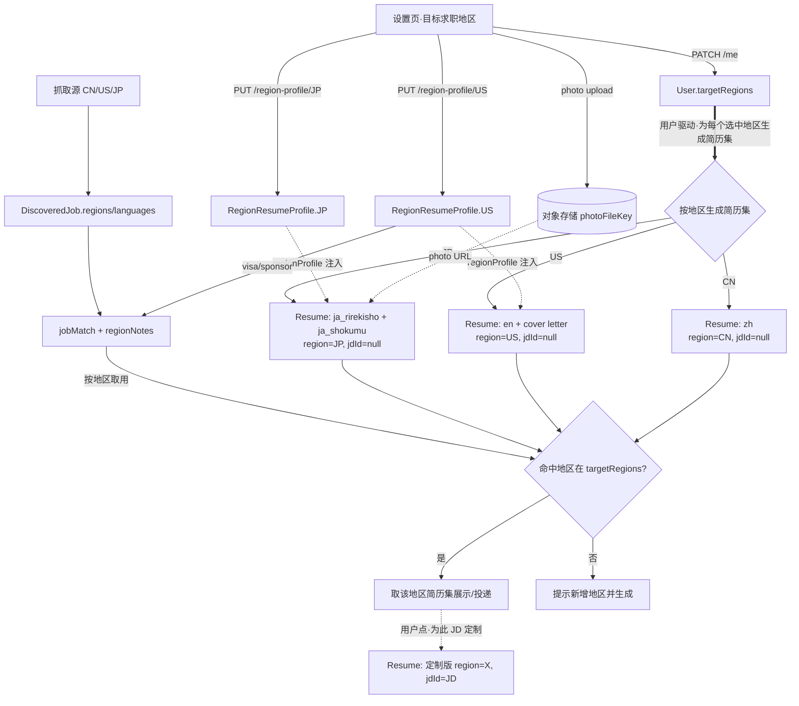

# CareerOS 多地区简历架构开发计划书

> 版本：v1.1 ｜ 日期：2026-07-29 ｜ 作者：WorkBuddy ｜ 执行：hy3
> 关联文档：`docs/competitor-searchsteward.md` §5.2（市场/语言错位）、§6（可移植性矩阵）、§7（路线图）
> 代码基线：`apps/worker/src/sources/index.ts`、`packages/db/prisma/schema.prisma`、`apps/worker/src/jobs/resumeGenerate.ts`、`apps/web/src/lib/merge-personal.ts`、`apps/web/src/app/(app)/settings/page.tsx`
>
> **v1.1 变更（架构方向调整，2026-07-29）**：把简历生成从「JD 驱动、被动路由」改为「**用户驱动的各地区独立简历集**」——用户在设置里选定投递地区后，系统为**每个选中地区各生成并维护一套地区定制简历集**（CN=zh；US=en+cover letter；JP=履歴書+職務経歴書），JD 匹配时直接取对应地区那一套。数据模型仍采用**单一 `RegionResumeProfile` + `fields` Json**（不拆三表）。详见 §4.3、§4.6、§8-D2/D6。

---

## 0. 摘要（TL;DR）

CareerOS 当前抓取源已覆盖**中国 / 美国 / 日本**三大市场（详见 §2.3），而这三地对「简历」的定义、字段、格式、合规红线差异巨大。现状是简历生成管线（`resumeGenerate.ts`）**已经**为中文/英文/日文履歴書/職務経歴書四种类型预留了枚举与 prompt，但**用户侧没有「我投哪些地区」的声明**，也没有按地区分桶的个人信息采集入口——所有地区信息堆在一个扁平 `personal` Json 里，且没有任何「目标地区」概念来驱动简历生成与 JD 匹配提示。

本计划书给出一套**增量、低爆炸半径**的架构方案：

1. `User.targetRegions`（多选 CN/US/JP）——声明求职目标地区（**用户驱动**的核心开关）。
2. 新增 `RegionResumeProfile` 模型——按 `(userId, region)` 分桶存地区专属字段 + 照片（对象存储）。
3. 设置页新增「目标求职地区」卡片 + 条件渲染的地区表单。
4. **地区简历集**：给 `Resume` 加 `region` 标签，为每个选中地区各生成并维护一套地区定制简历集（CN=zh；US=en+cover letter；JP=履歴書+職務経歴書），`resumeGenerate` / `mergePersonalIntoResume` 按地区注入专属字段。
5. JD 匹配时**直接选取对应地区那套简历集**，并按地区给出签证/格式提示（呼应 §5.2 本地化）。

全部复用既有 `requireUser()` 行级隔离（已修复数据隔离漏洞，见 §6）。

---

## 1. 背景与目标

### 1.1 问题

抓取源已天然分地区，但简历侧是「一刀切」：

| 市场 | 代表抓取源 | 简历形态 | 关键差异 |
|---|---|---|---|
| 中国 (CN) | tencent / bytedance / liepin / boss / green / netease / mihoyo / pingan / efund / cmb | 单页中文简历 | 手机号、意向城市、学历；年龄/婚育敏感（不建议写）；可含期望薪资 |
| 美国 (US) | greenhouse×N / lever×N / indeed / remoteok / hackernews / angellist | 1–2 页英文 resume + cover letter | **签证/工签状态**是硬门槛（H1B/L1/O1/OPT/绿卡/公民，是否需要 sponsor）；反歧视法禁止照片/年龄/性别 |
| 日本 (JP) | wantedly（+ 探针日系源） | **履歴書 + 職務経歴書 两件套** | 必贴**证件照**、ふりがな、生年月日、住所、志望動機、自己 PR、免許資格；ですます調/だである調 |

用户现在**无法**告诉系统「我要投美国，所以需要填 visa；我要投日本，所以要传照片、填ふりがな」。系统也无法在匹配某条 JP 岗时自动生成 rirekisho、或在匹配 US 岗时提示「此岗需 visa sponsor」。

### 1.2 目标

- G1：用户在设置里**选择目标求职地区**（可多选），UI 只展示所选地区的专属字段。
- G2：用户按地区填写专属信息（US visa / JP 照片+履歴書字段 / CN 期望薪资等）。
- G3：**用户驱动**——用户选定目标地区后，系统为**每个选中地区各生成并维护一套地区定制简历集**（CN=zh；US=en+cover letter；JP=履歴書+職務経歴書），注入地区专属字段（复用既有 ja 双类型能力）。简历集是一等产物，独立于任何具体 JD 存在。
- G4：JD 匹配/看板**优先取对应地区的简历集**，并按地区给出本地化提示（签证要求、格式提醒）；仅当用户要为某条 JD 定制时，才在地区简历集基础上再生成带 `jdId` 的定制版。
- G5：敏感 PII（人脸照片、身份证号、SSN、visa 类型）安全存储、行级隔离、不进日志/embedding。

### 1.3 非目标（本期不做）

- 不自动判定「用户属于哪个地区」（由用户在设置显式选择，避免误判）。
- 不做跨地区简历的机器翻译自动发布。
- 不接第三方背景调查（BGV）。
- 不扩展 EU/UK/SG 等更多地区（枚举与模型预留，但本期只落 CN/US/JP）。

---

## 2. 现状分析（基于对代码的核对）

### 2.1 承重墙：已具备的能力 ✅

| 能力 | 位置 | 说明 |
|---|---|---|
| 简历类型枚举 | `schema.prisma` L60-69 `ResumeType` | 已含 `zh` / `en` / `ja_shokumu` / `ja_rirekisho` / `linkedin` / `cover_letter` |
| 日文双文书 prompt | `resumeGenerate.ts` L38-50 `JA_EXTRA` | 已为 `ja_shokumu`/`ja_rirekisho` 写两套文体指令 + `x-jis` 输出形状（`shokumuYoyaku`/`ikaseruKeiken`/`jikoPR`/`shiboudouki`/`menkyoShikaku`） |
| US 工签状态 | `schema.prisma` L139-145 `WorkAuthStatus` + L172 `User.workAuthStatus` | 已建模 `us_authorized` / `requires_sponsorship` / `other` |
| 共享个人档案 | `schema.prisma` L255 `CareerProfile.personal Json` | 注释已预留「证件照 base64、联系地址、日本履历书专用字段」 |
| 个人→简历注入点 | `apps/web/src/lib/merge-personal.ts` | `mergePersonalIntoResume(resume, user, profile)` 已合并 `photo/address/furigana/birthDate` |
| 照片统一注入约定 | `resumeGenerate.ts` L88-89 注释 | 明确「照片/地址/日本履历书个人信息由共享个人档案统一管理，导出时注入，简历自身不保留」 |
| 行级隔离 | `apps/web/src/lib/api.ts` `requireUser()` | 已修复 fallback 数据隔离漏洞，所有查询带 `userId` |

> 结论：**最难的「日文双文书生成」已经做完**，本期主要是「把地区选择与地区专属信息采集做进设置页，并让生成/匹配感知地区」。这是增量工作，不是重写。

### 2.2 当前缺口（要补的）

1. **无「目标地区」概念**：`User` 只有一个自由文本 `region`（`schema` L168）和 `preferredCity`，没有结构化的「我投哪些地区」多选。
2. **个人信息扁平无分桶**：`CareerProfile.personal` 是单一 Json，地区字段（furigana/birthDate/photo…）混在一起，无法按地区开/关，也无法区分「仅 JP 要、仅 US 要」。
3. **照片存 base64 内联**：`personal.photo` 是 base64 字符串，直接塞 DB Json 行，会撑大行、无法裁剪/CDN、无访问控制。JP 必贴照片，必须改成对象存储 `fileKey`。
4. **US visa 细节缺失**：`WorkAuthStatus` 只有三档，没有具体签证类型（H1B/L1/O1/OPT/TN…）与「是否需 sponsor」的细颗粒度（虽 `requires_sponsorship` 已涵盖，但生成 cover letter 时需引用更细类型）。
5. **设置页无地区表单**：当前 `settings/page.tsx` 仅有 `region` 文本输入 + `workAuthStatus` + `languages`，无地区分支。
6. **JD 匹配不感知地区**：`jobMatch.ts` 产分数但没按 JD 地区给「签证/格式」提示（呼应 §5.2 本地化）。
7. **`Resume` 无地区标签**：`Resume`（`schema` L561-582）只有 `resumeType` 与可空 `jdId`，无 `region` 维度，**无法把简历按地区组织成「简历集」**，也无法查询「US 那套的基础简历」。用户驱动方案需给 `Resume` 加 `region` 标签（见 §4.1/§8-D6）。

### 2.3 抓取源地区分布（来自 `sources/index.ts`）

```
CN: tencent, bytedance, liepin, boss, green, netease, mihoyo, pingan, efund, cmb
US: greenhouse 家族(stripe/datadog/figma/anthropic/...数十个),
    lever 家族(spotify/binance/angellist/...), indeed, remoteok, hackernews, angellist
JP: wantedly (+ 探针日系源，见 scripts/probe-cn-sources.ts 旁注)
```

> JD 的「地区」可由现有 `DiscoveredJob.regions`（`schema` L637，location 归一化数组）+ `languages`（`L638`）推断，用作**匹配时取用哪套地区简历集**与地区提示的依据（生成本身由用户 `targetRegions` 驱动，见 §4.3）。

---

## 3. 领域建模：地区差异拆解

### 3.1 字段矩阵

| 字段 | CN | US | JP | 敏感级别 | 备注 |
|---|:--:|:--:|:--:|---|---|
| 手机号 mobile | ✅ | — | — | 中 | 已在 `User.mobile` |
| 意向城市 preferredCity | ✅ | — | — | 低 | 已在 `User.preferredCity` |
| 期望薪资 expectedSalary | ✅(选) | — | — | 中 | 仅用于表单自动填充 |
| 身份证号 idNumber | ✅(选) | — | — | **高** | 建议不强求，UI 明确「仅本地表单填充用」 |
| 户籍 hukou | ✅(选) | — | — | 高 | 同上 |
| 工签状态 workAuthStatus | — | ✅ | — | 高 | 已在 `User`；本期细化为 visaType |
| 签证类型 visaType | — | ✅ | — | 高 | H1B/L1/O1/OPT/TN/GreenCard/Citizen |
| 是否需 sponsor needsSponsorship | — | ✅ | — | 高 | 与 `workAuthStatus` 同步 |
| LinkedIn URL | — | ✅ | — | 低 | 已在 `User.snsLinks` |
| 证件照 photo | — | ❌(禁) | ✅ | **高(人脸)** | US 反歧视法禁止；JP 必贴 |
| ふりがな furigana | — | — | ✅ | 低 | 日文专属 |
| 生年月日 birthDate | — | — | ✅ | 中 | 日文专属 |
| 住所 address | — | — | ✅ | 中 | 日文专属（本籍可空） |
| 免許資格 menkyo | — | — | ✅ | 低 | 数组 [{name, date}] |
| 志望動機/自己PR | — | — | ✅ | 低 | 由生成管线 x-jis 产出，用户可微调 |

> 关键规则差异：
> - **US**：绝不放照片/年龄/性别（反歧视法）。visa 类型是硬门槛，cover letter 常需声明 sponsor 状态。
> - **JP**：履歴書必贴照片（否则减分）、ふりがな/生年月日/住所为表记必需；文体ですます調（履歴書）/だである調（職務経歴書）。
> - **CN**：单页、突出项目与量化；年龄/婚育属敏感信息，UI 应提示「不建议填写」。

---

## 4. 目标架构

### 4.1 数据模型（Prisma）

```prisma
// 地区码（预留扩展）
enum RegionCode {
  CN
  US
  JP
  // EU / UK / SG 预留，本期不落

  @@map("region_code")
}

// 用户目标求职地区（多选）
model User {
  // ... 现有字段 ...
  targetRegions RegionCode[] @default([]) @map("target_regions")
  // workAuthStatus 保留为 US 快捷入口（见 §4.4 同步规则）
}

// 按地区分桶的简历专属档案（每用户每地区一条）
model RegionResumeProfile {
  id            String     @id @default(dbgenerated("gen_random_uuid()")) @db.Uuid
  userId        String     @map("user_id") @db.Uuid
  region        RegionCode
  fields        Json       @default("{}") @map("fields")   // 地区专属字段（见 §3.1 矩阵）
  photoFileKey  String?    @map("photo_file_key")          // 仅 JP 用，存对象存储 key
  photoUpdatedAt DateTime?  @map("photo_updated_at")
  createdAt     DateTime   @default(now()) @map("created_at") @db.Timestamptz()
  updatedAt     DateTime   @default(now()) @updatedAt @map("updated_at") @db.Timestamptz()

  user User @relation(fields: [userId], references: [id], onDelete: Cascade)

  @@unique([userId, region])
  @@map("region_resume_profiles")
}
```

**`fields` Json 形态（按 region 取值）：**
```jsonc
// CN
{ "expectedSalary": "30-40k", "idNumber": null, "hukou": null }
// US
{ "visaType": "H1B", "needsSponsorship": true, "linkedinUrl": "https://linkedin.com/in/xxx" }
// JP
{ "furigana": "やまだ たろう", "birthDate": "1990-04-01", "address": "東京都渋谷区...",
  "menkyo": [{ "name": "TOEIC 900", "date": "2024-03" }] }
```

> **设计取舍（数据模型，已定）**：未把字段拍平成独立列，而用 `fields Json`，理由——地区字段会随后续地区扩展演进，Json 避免频繁 migration；但 `photoFileKey` 单独成列以便对象存储生命周期管理与访问控制（不随 `fields` 整体读写）。虽可按 region 拆三张强类型表（`CnProfile`/`UsProfile`/`JpProfile`），但代价是迁移与查询分支更多——**本计划确定采用「单一 `RegionResumeProfile` + Json + 独立 photo 列」**，不拆表（决策见 §8-D1）。

**简历集分区（`Resume` 加 `region` 标签，支撑用户驱动方案）：**
```prisma
model Resume {
  // ... 现有字段：resumeType / jdId / resumeJson / status ...
  region RegionCode? @map("region")   // 该简历属于哪个地区简历集；jdId=null 为地区基础简历，非空为针对具体 JD 的定制版
  @@index([userId, region])
}
```
> 组织规则：`(userId, region, jdId=null)` = 该地区的**基础简历集**（用户驱动预生成）；`jdId != null` = 在基础集之上针对某 JD 的定制版。JP 地区一套含 `ja_rirekisho` + `ja_shokumu` 两条 `Resume`（同 region、同 jdId），共同构成该地区简历集。

### 4.2 设置页改造（`settings/page.tsx`）

新增一节「目标求职地区」卡片，置于「账户」卡之后：

1. **地区多选 toggle**：中国 / 美国 / 日本（来自 `User.targetRegions`）。切换即写库（`PATCH /me` 扩 `targetRegions`）。
2. **条件渲染地区表单**：每选一个地区，下方出现对应区块；未选地区完全不渲染，避免「填写了用不到的字段」。
   - **CN 区块**：期望薪资、身份证号(选,带敏感提示)、户籍(选)。
   - **US 区块**：visa 类型 select（H1B/L1/O1/OPT/TN/绿卡/公民）+ 「需要 sponsor」开关（与 `workAuthStatus` 联动）。
   - **JP 区块**：ふりがな、生年月日、住所、免許資格(可增删数组)、**证件照上传**（见 §4.4）。
3. **保存**：每个地区区块独立 `PUT /api/v1/region-profile/{region}`（行级隔离由 `requireUser` 保证）。
4. **i18n**：所有 label 走 `messages/*.json`（现有 `useT` 体系）。

> 复用 §上一轮已修的「设置页去重」结论：身份基础字段（name/mobile/preferredCity）只在「个人信息」页编辑，本节只放**地区专属**字段，不重复。

### 4.3 简历生成 / 匹配回流

**生成模型：用户驱动的地区简历集（`resumeGenerate.ts` + `buildFactPack`）**

不再等到匹配某条 JD 才被动路由，而是以 `User.targetRegions` 为驱动，为**每个选中地区各产出一套地区基础简历集**（`jdId=null`、`region=<地区>`）：

- **触发时机**：用户在设置里勾选/新增目标地区，或补全该地区 `RegionResumeProfile` 后，触发该地区简历集（重）生成；用户也可在「简历」页手动为某地区一键重生成。
- `region = JP` → 产出 `ja_rirekisho` + `ja_shokumu` 两条 `Resume`（同 region、`jdId=null`），注入 `RegionResumeProfile.JP` 的 `furigana/birthDate/address/menkyo/photo`（走现有 `mergePersonalIntoResume` 扩展点）。
- `region = US` → 产出 `en`（+ 可选 `linkedin`）+ `cover_letter`；`workAuthStatus`/`visaType` 注入 `basics` 或 `x-us` 段，cover letter 引用 sponsor 状态。
- `region = CN` → 产出 `zh`；`expectedSalary` 注入摘要。
- **只为选中地区生成**：未在 `targetRegions` 中的地区不生成、不占用算力（呼应 §5.3 冷启动/成本）。

**JD 匹配时的取用（从「路由生成」变为「选取 + 可选定制」）：**
- 匹配到一条 JD → 由 `DiscoveredJob.regions/languages` 推断其地区 → **直接取用户该地区的基础简历集**展示/投递（用户可在看板覆盖 JD 地区，避免误判）。
- 若 JD 地区不在用户 `targetRegions` 内 → 提示「你尚未把该地区加入目标，是否新增并生成简历集？」。
- 仅当用户点「为此 JD 定制」时，才在该地区基础集之上生成带 `jdId` 的定制版 `Resume`（前置相关经历，同 §既有 matchedEvidence 逻辑）。

**注入点改造（`merge-personal.ts`）：**
```ts
// 现状
mergePersonalIntoResume(resume, user, profile)
// 目标：增加 regionProfile 参数，地区字段优先用地区档案
mergePersonalIntoResume(resume, user, profile, regionProfile?: RegionResumeProfile)
```
- JP：`photo`/`address`/`furigana`/`birthDate` 优先取 `regionProfile.JP`（对象存储 key → 预览时取 URL）。
- US：basics 追加 `x-us: { workAuth, visaType }`。
- CN：`expectedSalary` 追加到 summary/摘要。

**JD 匹配提示（`jobMatch.ts`）：**
- 产出增加 `regionNotes: string[]`（呼应 §5.2 本地化），例如：
  - US 岗 + 用户 `requires_sponsorship` → "该岗位位于美国，请确认是否提供 H1B 赞助"。
  - JP 岗 → "日本岗通常需另附履歴書（含证件照）与職務経歴書"。
- 前端匹配结果卡展示 `regionNotes`。

### 4.4 照片存储（JP 必贴）

- 上传：`POST /api/v1/region-profile/photo`（`multipart/form-data`，`requireUser`），存对象存储（S3/OSS），返回 `fileKey`，写 `RegionResumeProfile.photoFileKey`。
- 预览：前端用带签名 URL 或 CDN 展示；提供裁剪（1寸/履歴書 規定寸法 約 30×40mm）。
- **绝不**把 base64 再写回 `fields`/`personal`，避免 DB 行膨胀与 PII 泄露面扩大。
- 访问控制：照片读取必须带 `userId` 校验（同 `requireUser`），不公开。

### 4.5 API 设计

| 方法 | 路径 | 说明 |
|---|---|---|
| PATCH | `/me` | 扩 `targetRegions: RegionCode[]` |
| GET | `/api/v1/region-profile/:region` | 取某地区档案（行级隔离） |
| PUT | `/api/v1/region-profile/:region` | 写某地区 `fields`（行级隔离） |
| POST | `/api/v1/region-profile/photo` | 上传照片 → `fileKey` |
| DELETE | `/api/v1/region-profile/photo` | 删除照片 |

> 全部复用 `requireUser()`（已修复数据隔离），禁止任何公开路由读写 `RegionResumeProfile`。

### 4.6 架构数据流（mermaid）



---

## 5. 实施路线图

> 工作量为人天粗估（含联调与自测），实际以排期为准。KPI 来自可观测指标。

### P0 — 基础采集（约 1.5–2 周）

| 项 | 内容 | 人天 | KPI |
|---|---|---|---|
| P0-1 | `RegionCode` 枚举 + `User.targetRegions` + `RegionResumeProfile` 模型 + **`Resume.region` 标签** + migration | 2–3d | migration 通过；类型检查 0 错 |
| P0-2 | 设置页「目标求职地区」多选 + 条件渲染 CN/US/JP 表单 | 3–4d | 选地区→对应区块出现；未选→不渲染 |
| P0-3 | `/api/v1/region-profile/:region` CRUD + `/me` 扩 targetRegions | 2d | 写后再读一致；A 用户读不到 B（行级隔离） |
| P0-4 | JP 照片上传到对象存储 + 预览裁剪 | 3d | 上传→fileKey 回写→预览成功；无 base64 内联 |

**P0 验收**：设置页可选 1+ 地区并填地区专属信息；数据隔离验证通过。

### P1 — 生成与匹配回流（约 2–3 周）

| 项 | 内容 | 人天 | KPI |
|---|---|---|---|
| P1-1 | **用户驱动生成地区简历集**：`buildFactPack`/`resumeGenerate` 按 `targetRegions` 为每个选中地区各产出一套基础简历集（`jdId=null`、打 `region` 标签），设置页保存地区后触发（重）生成 | 4d | 选 US+JP → 各得一套基础集（JP 两份、US en+cover letter）；未选地区不生成 |
| P1-2 | `mergePersonalIntoResume` 扩展 regionProfile 注入（JP 照片/furigana/address；US x-us；CN 薪资） | 3d | 生成结果含地区字段；mock 路径同步 |
| P1-3 | JD 匹配**取用地区简历集** + `jobMatch` 增 `regionNotes` + 前端展示；命中地区不在 targetRegions 时提示新增 | 3d | 匹配到 JD 直接取对应地区那套；US 岗 + requires_sponsorship → 提示赞助；JP 岗 → 提示双文书 |
| P1-4 | i18n label 补全（messages/*.json） | 1–2d | 三地区 label 中/英/日齐全 |

**P1 验收**：选 JP→生成 rirekisho 自动含照片/ふりがな；选 US→en resume 含 work auth，cover letter 引用 sponsor；JD 匹配出地区提示。

### P2 — 增强与收敛（约 1–2 周）

| 项 | 内容 | 人天 | KPI |
|---|---|---|---|
| P2-1 | 排行榜/匹配器按地区过滤展示（接 §6 矩阵 matchRegions） | 2–3d | 公开页可按地区筛选 |
| P2-2 | `personal` 历史字段迁移脚本（旧 flat → 按 region 归桶；photo base64 → 对象存储） | 2d | 迁移后旧数据不丢；DB 行缩小 |
| P2-3 | 隐私审计：PII 不进日志/AiRun/embedding；照片访问控制测试 | 1–2d | 审计 0 泄露 |

**P2 验收**：历史数据迁移无损；敏感字段不在任何日志/embedding 出现。

---

## 6. 风险与前提

1. **PII 合规（最高优先级）**：人脸照片（JP）、身份证号（CN）、SSN/visa 类型（US）均为高敏。措施——对象存储 + 单独访问控制 + 不进日志/`AiRun`/`Embedding`；CN 身份证 UI 明确「仅本地表单自动填充，不强求」。
2. **照片存储迁移**：从 `personal.photo` base64 内联 → `photoFileKey`。P2-2 做迁移，P0-4 起新数据不再写 base64。
3. **单一真相冲突**：`User.workAuthStatus`（US 快捷）与 `RegionResumeProfile.US.visaType` 可能双写。**同步规则**：`workAuthStatus` 为 US 工签的总开关（`requires_sponsorship` 即「需 sponsor」）；`visaType` 为细分类型，写 `visaType` 时自动回写 `workAuthStatus`（有具体类型→非 citizen/绿卡即 `requires_sponsorship`）。设置页 US 区块两字段同屏编辑，保存时一起校验。
4. **地区判定口径**：JD region 由 `DiscoveredJob.regions/languages` 推断，但中文源也可能招海外。允许用户在看板手动覆盖 JD region，避免误生成。
5. **i18n 工作量**：三地区 label 需中/英/日，messages 文件补全。
6. **与既有 personal 注入的兼容**：`mergePersonalIntoResume` 改造需保留「历史简历自身残留值兜底」，保证未填地区档案的简历仍能导出（见该函数 L18-19 注释约定）。

---

## 7. 验收标准（总表）

| # | 标准 | 验证方式 |
|---|---|---|
| 1 | 设置页可选 1+ 目标地区，未选区不显示其字段 | 浏览器走查（多选 toggle + 条件渲染） |
| 2 | JP：可上传照片、填ふりがな/生年月日/住所/免許 → 生成 rirekisho 自动注入 | 生成 + 导出预览核对 |
| 3 | US：选 visa 类型 + sponsor 开关 → en resume 含 work auth；cover letter 引用 | 生成核对 |
| 4 | CN：填期望薪资 → zh resume 摘要含 | 生成核对 |
| 5 | JD 匹配**取对应地区的简历集**并给 `regionNotes`（签证/双文书提示）；命中地区不在 targetRegions 时提示新增 | 匹配结果卡展示 |
| 5b | **用户驱动**：勾选某地区（无需先有 JD）即为该地区生成一套基础简历集（`region` 标签、`jdId=null`）；取消/未选地区不生成 | 「简历」页按地区分组核对 |
| 6 | 数据隔离：A 用户读不到 B 用户的地区档案 | `requireUser` 单测 + 跨用户请求 401/空 |
| 7 | 敏感 PII 不进日志/AiRun/embedding；照片仅本人可读 | 隐私审计 |
| 8 | `pnpm --filter web typecheck` 0 错；走查无 console/page error | CI + Playwright |
| 9 | 契约层集成测试全绿（`mergePersonalIntoResume` 地区注入、`jsonResume`/`x-jis`/ResumeType 契约、`jdParsed` 打分契约） | `pnpm test`（见 [testing-guide.md](./testing-guide.md)） |

> **测试怎么跑**：静态检查与 vitest 集成测试的完整命令、约定、如何新增用例，见 [`docs/testing-guide.md`](./testing-guide.md)。本计划新增的地区注入/schema 逻辑落地后，应在该说明书 §4 覆盖表同步补充对应用例（如 `Resume.region` 简历集分组、`RegionResumeProfile` 校验）；`/api/v1/region-profile` 行级隔离与 `jobMatch` 全链路属其 §6 的 DB 端到端层。

---

## 8. 决策备忘

- **D1**：地区档案用「`RegionResumeProfile` 独立模型 + `fields` Json + `photoFileKey` 独立列」，而非拍平列或仅扩 `personal`。理由：扩展性与照片访问控制的平衡。
- **D2**（v1.1 调整）：生成模型为**用户驱动**——`User.targetRegions` 多选，系统为每个选中地区各生成并维护一套**基础简历集**（`jdId=null`）；JD 匹配时直接取对应地区那套，单条 JD 的 region 可在看板手动覆盖，用户点「为此 JD 定制」才生成带 `jdId` 的定制版。**不再采用「等匹配到 JD 才被动路由生成」**。
- **D3**：US 工签以 `workAuthStatus` 为总开关，`visaType` 为细分，双向同步。
- **D4**：照片一律对象存储，禁止 base64 内联进 DB。
- **D5**：本期只落 CN/US/JP，`RegionCode` 枚举预留 EU/UK/SG。
- **D6**（v1.1 新增）：`Resume` 加 `region` 标签组织「地区简历集」——`(userId, region, jdId=null)` 为地区基础集，`jdId != null` 为 JD 定制版；JP 一套含 rirekisho + shokumu 两条。地区专属**档案**数据仍用单一 `RegionResumeProfile + fields Json`，不拆三表（延续 D1）。

---

_附录：本计划书所有代码位置均经 2026-07-29 核对（`schema.prisma` / `resumeGenerate.ts` / `merge-personal.ts` / `settings/page.tsx` / `sources/index.ts`）。日文双文书生成能力（§2.1）为既有承重墙，本期在其上做增量。_
